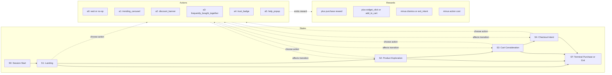
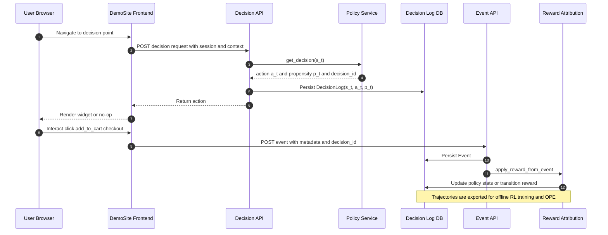
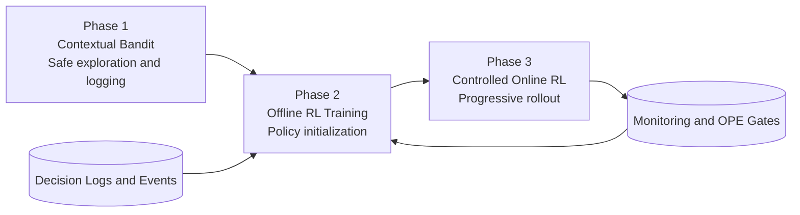

# Customer Journey as an MDP for the Thesis

## Why the MDP Framing Is Thesis-Relevant

1. It matches the business process.
- E-commerce behavior unfolds over time (landing -> browse -> pdp -> cart -> checkout).
- Rewards are delayed and sparse (purchase happens after many intermediate steps).

2. It gives a principled mathematical model.
- State captures what is known about the current session.
- Action captures intervention choice (including wait/no-op).
- Transition captures how user behavior changes after intervention.
- Reward captures both dense proxies and final conversion value.

3. It supports clear scientific comparison.
- You can compare stateless policies (heuristic, bandit) against sequential policies (offline RL, online RL).
- This creates a clean experimental narrative for thesis evaluation.

## Step-by-Step Plan for the Thesis

## Step 1: Define the MDP formally
Specify the tuple:
- States S
- Actions A
- Transition dynamics T(s, a, s')
- Reward R(s, a, s')
- Discount factor gamma

Suggested for this project:
- State: decision point, page depth, dwell bucket, scroll bucket, device type, traffic source, cart value bucket, item count bucket, time since last meaningful event.
- Action: no-op, trending_carousel, discount_banner, frequently_bought_together, trust_badge, help_popup.
- Terminal states: conversion, abandonment, timeout.
- Discount: gamma around 0.95.

Mermaid diagram (MDP view):

## Step 2: Define decision epochs and trajectory granularity
Decide when the agent may act:
- Event-triggered (page entry, cart update, checkout start), or
- Fixed interval polling (for timing control), or
- Hybrid.

For thesis clarity, start with event-triggered epochs and include explicit no-op so timing is still learned.

## Step 3: Build reward shaping with business constraints
Use a mixed reward:
- Dense positives: widget_click, add_to_cart, checkout_submit.
- Sparse major positive: purchase (optionally value-scaled by order total).
- Penalties: widget_dismiss, exit_intent, action serving cost.

Design rule:
- Make purchase dominant enough so the policy does not over-optimize clicks.

## Step 4: Validate data logging completeness
Ensure every transition includes:
- state s_t
- action a_t
- reward r_t
- propensity p_t
- next_state s_{t+1}
- done flag
- session/trajectory id
- timestamp

This is required for reliable offline policy learning and evaluation.

Mermaid diagram (system sequence):

## Step 5: Train a behavior policy first (safe data collection)
Deploy a conservative behavior policy (epsilon-greedy contextual bandit) to collect diverse but safe trajectories.

Thesis purpose:
- Mitigate cold start.
- Produce off-policy dataset for offline RL.

## Step 6: Construct offline RL dataset
From decision and event logs, reconstruct transition tuples per session.

Minimum quality checks:
- Coverage per decision point and action.
- Reward distribution sanity.
- Attribution diagnostics (how many events are matched to decisions).
- Support diagnostics for rare state-action pairs.

## Step 7: Offline policy training (V3 initialization)
Train a conservative offline policy before online deployment.

Good first sequence:
1. Tabular conservative FQI baseline.
2. Function-approximation method only after data volume increases (for example CQL or IQL style).

Output artifact:
- Serializable policy file with state-action preferences and per-decision-point defaults.

## Step 8: Offline policy evaluation (OPE) with uncertainty
Evaluate candidate policies using IPS, SNIPS, and DR with bootstrap confidence intervals.

Policy promotion gate example:
- DR lower bound better than no-op baseline.
- Importance weights in acceptable range.
- No strong degradation at critical decision points (cart, checkout).

## Step 9: Controlled online rollout
Deploy in stages:
1. Shadow mode (log only, no user effect).
2. Small traffic slice with strict guardrails.
3. Progressive rollout if KPI and safety criteria hold.

Guardrails:
- Maximum interventions per session.
- Forced no-op fallback for unknown/low-confidence states.
- Auto rollback trigger.

## Step 10: Continuous learning and thesis evaluation
Operate a train-evaluate-deploy loop:
- Retrain periodically on latest logged data.
- Re-evaluate with OPE and online A/B metrics.
- Track calibration drift and state distribution shift.

Report in thesis:
- Primary KPI: conversion/revenue uplift.
- Secondary KPI: engagement quality and intervention cost.
- Robustness: performance by segment (device, source, journey stage).

## Suggested Thesis Chapter Mapping
- Chapter 1: Problem framing and motivation (why delayed effects matter).
- Chapter 2: MDP formalization and reward design.
- Chapter 3: System architecture and data pipeline.
- Chapter 4: Offline training and OPE methodology.
- Chapter 5: Online rollout strategy and safeguards.
- Chapter 6: Results, ablations, limitations, and future work.

## Risks and How to Address Them
- Non-Markov state approximation:
  Add short history features or recurrent model later.

- Sparse terminal rewards:
  Keep dense shaping terms but cap their influence.

- Distribution shift from offline to online:
  Use conservative training and staged rollout.

- Small dataset bias:
  Start with simple models, report uncertainty, avoid over-claiming.

## Practical Conclusion
For this thesis, the strongest storyline is:
- Bandit as safe data-collection baseline.
- MDP as the correct formal model for customer journey optimization.
- Offline RL as initialization bridge.
- Controlled online RL as final step.

This yields both scientific rigor and practical deployment relevance.

Mermaid diagram (compact thesis pipeline):

