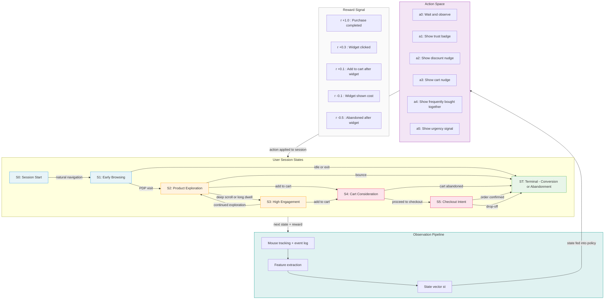

# MDP: Sequential Widget Timing Agent

## State Space, Actions, Transitions & Rewards

## MDP Formal Definition

| Component | Definition |
|---|---|
| **State S** | Session trajectory vector: page depth, scroll depth, dwell time, mouse movement cluster, cart total, item count, pages visited, time since last event |
| **Action A** | {wait, trust\_badge, discount\_nudge, cart\_nudge, frequently\_bought\_together, urgency\_signal} |
| **Transition T(s, a, s')** | Stochastic — user behavior in response to widget (or absence of one) |
| **Reward R(s, a, s')** | Shaped: immediate cost on show, positive signal on click/add-to-cart/purchase, negative on post-widget abandonment |
| **Discount γ** | γ < 1 (e.g. 0.95) — later conversions worth slightly less, reflecting session time pressure |
| **Observation Δt** | Periodic polling interval (e.g. every 10–30 seconds) rather than event-triggered |
| **Policy π** | Learned mapping sₜ → aₜ (e.g. DQN, PPO, or recurrent policy for partial observability) |

## Key Difference vs. V2 Bandit

The bandit fires once per fixed trigger point (page load, add-to-cart event) and has no session memory.
The MDP agent **continuously observes** the session state and decides both *when* to act and *what* to show — enabling it to learn that the same widget at different journey stages produces very different outcomes.
